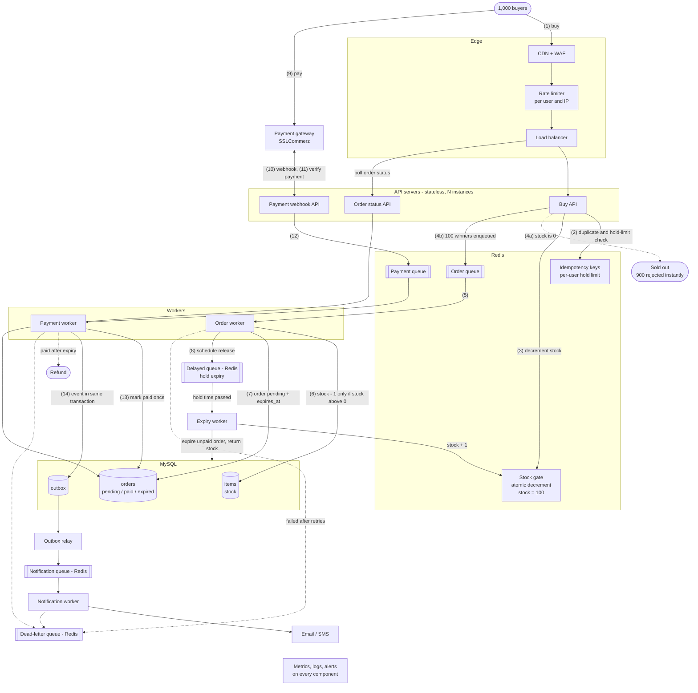

```mermaid
flowchart TB
    B(["1,000 buyers"])
    PG["Payment gateway<br/>SSLCommerz"]

    subgraph EDGE["Edge"]
        CDN["CDN + WAF"]
        RL["Rate limiter<br/>per user and IP"]
        LB["Load balancer"]
        CDN --> RL --> LB
    end

    subgraph APP["API servers - stateless, N instances"]
        API["Buy API"]
        STAT["Order status API"]
        HOOK["Payment webhook API"]
    end

    subgraph REDIS["Redis"]
        IDEM["Idempotency keys<br/>per-user hold limit"]
        GATE["Stock gate<br/>atomic decrement<br/>stock = 100"]
        OQ[["Order queue"]]
        PQ[["Payment queue"]]
    end

    SOLD(["Sold out<br/>900 rejected instantly"])

    subgraph WORK["Workers"]
        OW["Order worker"]
        PW["Payment worker"]
    end

    subgraph DB["MySQL"]
        ITEMS[("items<br/>stock")]
        ORDERS[("orders<br/>pending / paid / expired")]
        OUTBOX[("outbox")]
    end

    DQ[["Delayed queue - Redis<br/>hold expiry"]]
    EW["Expiry worker"]
    OR["Outbox relay"]
    NQ[["Notification queue - Redis"]]
    NW["Notification worker"]
    MSG["Email / SMS"]
    REFUND(["Refund"])
    DLQ[["Dead-letter queue - Redis"]]
    MON["Metrics, logs, alerts<br/>on every component"]

    B -->|"(1) buy"| CDN
    LB --> API
    LB -->|"poll order status"| STAT
    STAT --> ORDERS

    API -->|"(2) duplicate and hold-limit check"| IDEM
    API -->|"(3) decrement stock"| GATE
    API -.->|"(4a) stock is 0"| SOLD
    API -->|"(4b) 100 winners enqueued"| OQ

    OQ -->|"(5)"| OW
    OW -->|"(6) stock - 1 only if stock above 0"| ITEMS
    OW -->|"(7) order pending + expires_at"| ORDERS
    OW -->|"(8) schedule release"| DQ

    B -->|"(9) pay"| PG
    PG <-->|"(10) webhook, (11) verify payment"| HOOK
    HOOK -->|"(12)"| PQ
    PQ --> PW
    PW -->|"(13) mark paid once"| ORDERS
    PW -->|"(14) event in same transaction"| OUTBOX
    PW -.->|"paid after expiry"| REFUND

    DQ -->|"hold time passed"| EW
    EW -->|"expire unpaid order, return stock"| DB
    EW -->|"stock + 1"| GATE

    OUTBOX --> OR
    OR --> NQ
    NQ --> NW
    NW --> MSG

    OW -.->|"failed after retries"| DLQ
    PW -.-> DLQ
    NW -.-> DLQ

    MSG ~~~ MON
```
