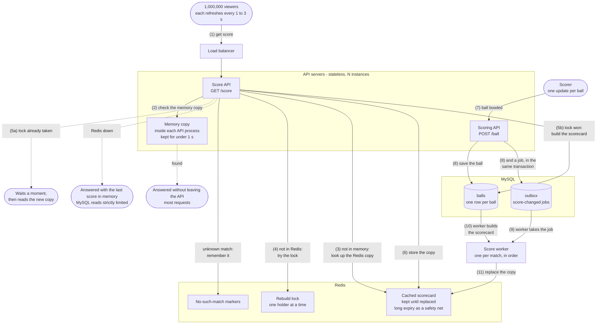

```mermaid
flowchart TB
    V(["1,000,000 viewers<br/>each refreshes every 1 to 3 s"])
    S(["Scorer<br/>one update per ball"])

    LB["Load balancer"]

    subgraph APP["API servers - stateless, N instances"]
        READ["Score API<br/>GET /score"]
        MEM["Memory copy<br/>inside each API process<br/>kept for under 1 s"]
        WRITE["Scoring API<br/>POST /ball"]
    end

    T5A["(5a) lock already taken"]:::step
    TDOWN["Redis down"]:::step
    TUNK["unknown match:<br/>remember it"]:::step
    T4["(4) not in Redis:<br/>try the lock"]:::step
    T3["(3) not in memory:<br/>look up the Redis copy"]:::step
    T6["(6) store the copy"]:::step
    T5B["(5b) lock won:<br/>build the scorecard"]:::step

    HIT(["Answered without leaving the API<br/>most requests"])
    WAIT(["Waits a moment,<br/>then reads the new copy"])
    LAST(["Answered with the last score in memory<br/>MySQL reads strictly limited"])

    subgraph REDIS["Redis"]
        MISSING["No-such-match markers"]
        LOCK["Rebuild lock<br/>one holder at a time"]
        COPY["Cached scorecard<br/>kept until replaced<br/>long expiry as a safety net"]
    end

    subgraph DB["MySQL"]
        BALLS[("balls<br/>one row per ball")]
        OUTBOX[("outbox<br/>score-changed jobs")]
    end

    WORKER["Score worker<br/>one per match, in order"]

    V -->|"(1) get score"| LB
    LB --> READ
    READ -->|"(2) check the memory copy"| MEM
    MEM -.->|"found"| HIT

    READ -.- T5A -.-> WAIT
    READ -.- TDOWN -.-> LAST
    READ --- TUNK --> MISSING
    READ --- T4 --> LOCK
    READ --- T3 --> COPY
    READ --- T6 --> COPY
    READ --- T5B --> BALLS

    S -->|"(7) ball bowled"| WRITE
    WRITE -->|"(8) save the ball"| BALLS
    WRITE -->|"(8) and a job, in the<br/>same transaction"| OUTBOX
    OUTBOX -->|"(9) worker takes the job"| WORKER
    BALLS -->|"(10) worker builds<br/>the scorecard"| WORKER
    WORKER -->|"(11) replace the copy"| COPY

    classDef step fill:#e8e8e8,stroke:none,color:#222
```
